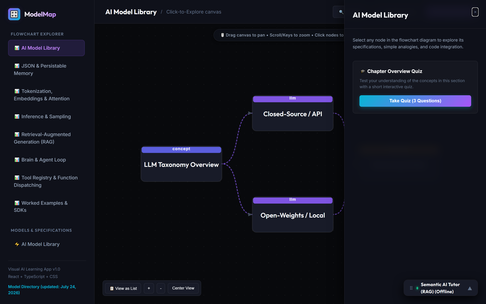
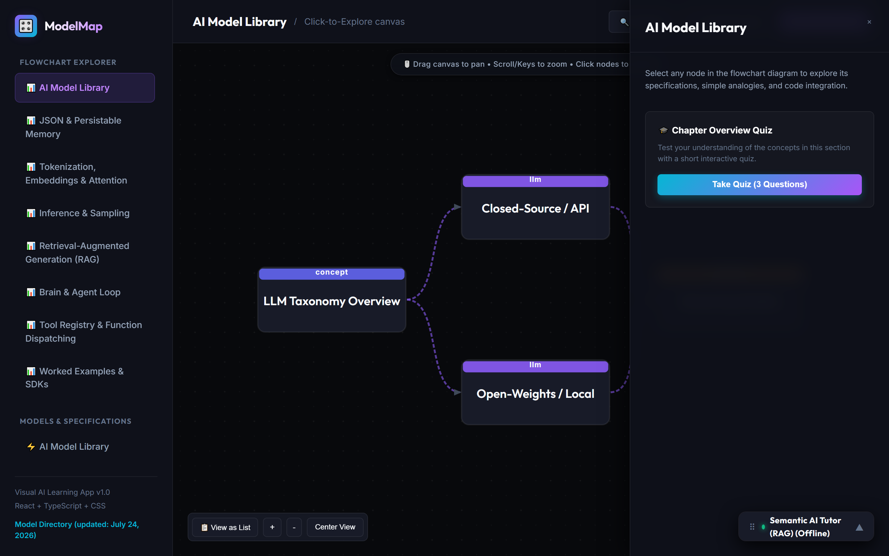
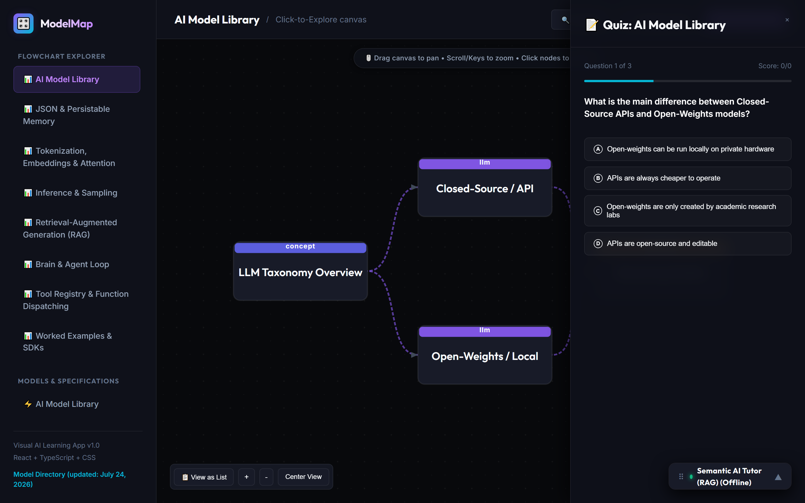
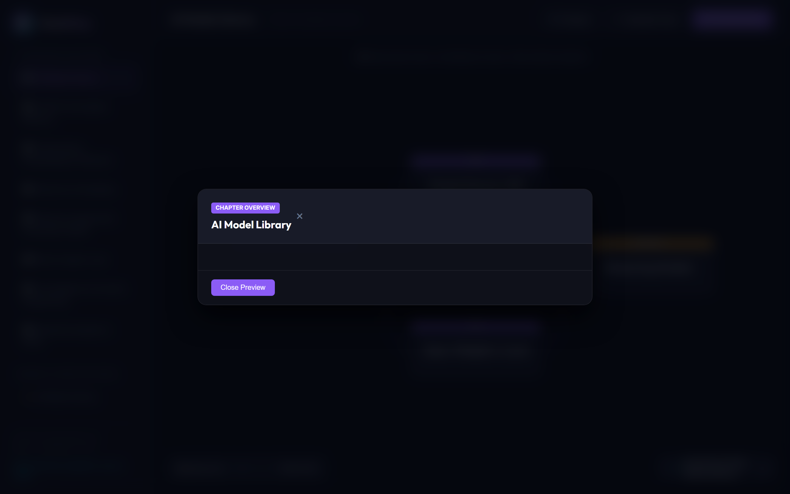
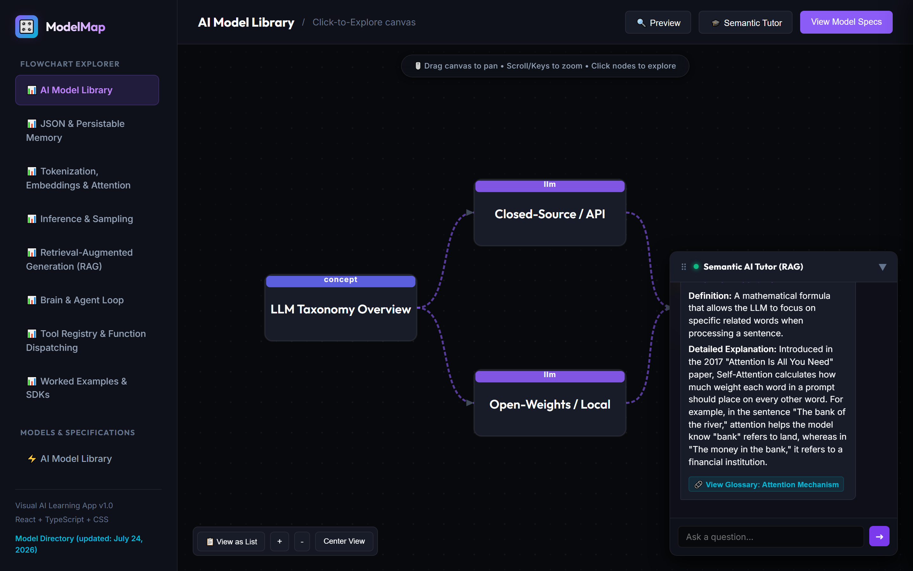
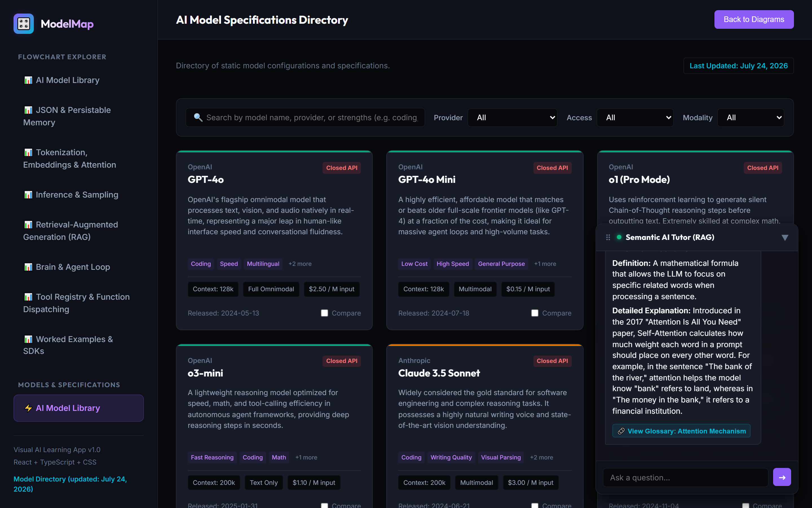

# 🎛️ ModelMap — AI & LLM Visual Learning Platform

ModelMap is an interactive, visual-first learning application designed to help users go from "what is an LLM" to understanding complex AI workflows (like RAG and Agents) using click-to-explore flowcharts, dynamic model specifications, interactive quizzes, and an in-app Semantic RAG AI tutor.

---

## 📸 Screenshots & UI Showcase

### 1. 📊 Interactive Flowchart Canvas
*Visual SVG diagram canvas with drag-to-pan, scroll-to-zoom, breadcrumb navigation, and an accessible text-based List View alternative.*


---

### 2. 📝 Node Explanation & Specifications Drawer
*Slide-out panel providing ELI5 analogies, detailed technical descriptions, glossary links, and code integration specifications.*


---

### 3. 🎓 Interactive Chapter Quizzes
*Step-by-step chapter comprehension quizzes with instant feedback, scoring progress, and explanation breakdowns.*


---

### 4. 🔍 Fullscreen Concept Lightbox Preview
*Full-screen concept lightbox preview with keyboard and swipe navigation controls (`ArrowLeft`, `ArrowRight`, `Escape`).*


---

### 5. 🤖 Semantic AI Tutor (Client-Side RAG)
*Draggable, collapsible AI assistant powered by Transformers.js (`all-MiniLM-L6-v2`) and precomputed TF-IDF + Levenshtein fuzzy search indices.*


---

### 6. ⚡ AI Model Library & Specifications Directory
*Searchable directory of 25+ top proprietary and open-weights models (OpenAI, Anthropic, Google, Meta, DeepSeek, etc.) with multi-attribute filtering, debounced search, WAI-ARIA grid semantics, and a side-by-side comparison matrix.*


---

## 🌟 Key Features

1. **Click-to-Explore Flowcharts**:
   - Visual diagrams for core concepts: **LLM Basics**, **Transformer Architecture**, **Prompt Construction**, **RAG**, and **AI Agents**.
   - Nodes expand into contextual side drawers explaining technical steps.
   - Zoom in/out, pan, keyboard controls, touch pinch-to-zoom, and enter nested sub-diagrams.

2. **Semantic RAG AI Chat Tutor**:
   - Client-side embedding search engine using `@xenova/transformers` (`all-MiniLM-L6-v2`) to answer user questions about the curriculum.
   - Draggable by mouse anywhere on screen with non-blocking UI position.

3. **Interactive Chapter Quizzes**:
   - End-of-chapter comprehension checks with progress tracking, score breakdown, and answer rationales.

4. **AI Model Specifications Directory**:
   - Searchable database of top models with provider, modality, context window lengths, costs, and access filters.
   - Compare up to 4 models side-by-side.

5. **Accessibility & Performance First**:
   - Full keyboard navigation (`Tab`, `Escape`, `Arrow` keys), WAI-ARIA combobox & treeview roles, non-blocking toast notifications, and `prefers-reduced-motion` compliance.

---

## 🛠️ Technology Stack

- **Framework**: React 19 + TypeScript
- **Bundler & Build Tool**: Vite 8
- **Embeddings & ML**: `@xenova/transformers` (Client-side `all-MiniLM-L6-v2`)
- **Testing**: Playwright E2E Test Suite
- **Styling**: Vanilla CSS (Cyberpunk dark slate custom design system using CSS variables)
- **Linter**: Oxlint

---

## 🚀 Getting Started

### Prerequisites

Ensure you have [Node.js](https://nodejs.org/) installed (LTS version recommended).

### Installation

1. Clone the repository:
   ```bash
   git clone https://github.com/varuna1704/llm-learining-models.git
   cd "model 1"
   ```

2. Install dependencies:
   ```bash
   npm install
   ```

### Development Server

Run the development server locally:
```bash
npm run dev
```
Open [http://localhost:5174](http://localhost:5174) in your browser to view the application.

### Running End-to-End Tests

Execute Playwright E2E tests:
```bash
npx playwright test
```

### Building for Production

Compile and bundle the application for production:
```bash
npm run build
```
The output will be generated in the `dist/` directory.
